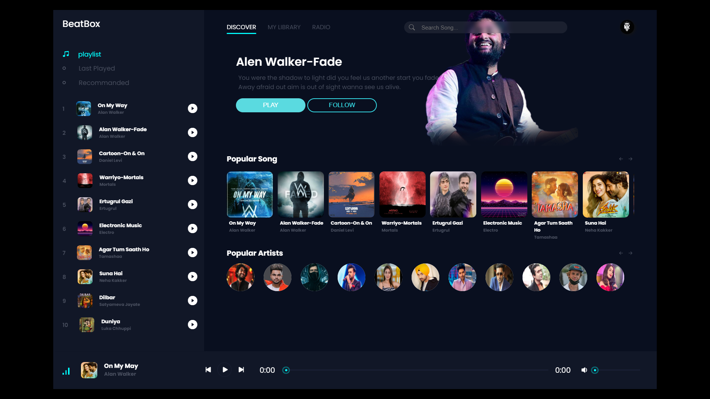

# music-player

A lightweight and straightforward music player built with HTML, CSS, and JavaScript. This project provides basic functionalities to play and manage audio files with a responsive design.

## Features

- **Play Music**: Load and play audio files.
- **Basic Controls**: Play, pause, and stop tracks.
- **Volume Control**: Adjust the volume level.
- **Responsive Design**: Adapted for various screen sizes.

## Demo



## File Structure

- **`index.html`** - The main HTML file that sets up the structure of the player.
- **`styles.css`** - Contains all the styles for the music player.
- **`script.js`** - Handles the logic and functionality of the music player.
- **`public/audio/`** - Directory for storing audio files.


## Installation

1. **Clone the Repository**:

   ```sh
   git clone https://github.com/NitinChaudhary007/music-player.git
